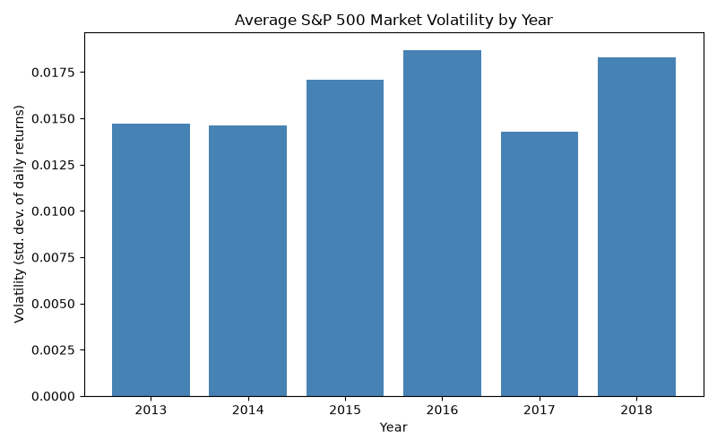

# Investment Performance Analysis (S&P 500)

# Overview

I am interested in investing and the Fintech industry, so I wanted to learn how to use Python and Pandas to turn raw market data into clear answers. With this project I practiced loading and cleaning a large dataset, grouping data by stock and by year, calculating statistics like returns and volatility, and showing the results in a chart.

The dataset is [S&P 500 stock data](https://www.kaggle.com/datasets/camnugent/sandp500) by Cam Nugent on Kaggle. I used the file `all_stocks_5yr.csv`, which has 619,040 rows of daily prices (open, high, low, close and volume) for 505 companies in the S&P 500, from February 8, 2013 to February 7, 2018.

The software has two files:

* `data_loader.py` reads the CSV file, converts the dates, fills a few missing open/high/low values, sorts the data by stock and date, and calculates the daily return of each stock.
* `analysis.py` uses the cleaned data to answer three questions about stock performance and market risk, prints the results, and saves a bar chart (`annual_volatility.png`).

**How to run it**

1. Install the libraries: `pip install pandas matplotlib`
2. Download `all_stocks_5yr.csv` from the Kaggle link above and put it in the same folder as the Python files. (The CSV file is not included in this repository because it is too large.)
3. Run: `python analysis.py`

[Software Demo Video](http://youtube.link.goes.here)

# Data Analysis Results

### Question 1: Which stocks had the best risk-adjusted return in the period?

To measure risk-adjusted return, I divided each stock's total return (in percent) by its volatility (the standard deviation of its daily returns). This is a simplified version of the Sharpe ratio. A higher number means the stock gave more return for each unit of risk. The numbers are large because the return is in percent and the volatility is a decimal, but they work well for ranking the stocks.

| Rank | Stock | Total return (%) | Volatility | Risk-adjusted return |
|---|---|---|---|---|
| 1 | NVDA | 1749.64 | 0.0224 | 78281.94 |
| 2 | NOC | 410.91 | 0.0109 | 37672.17 |
| 3 | STZ | 572.37 | 0.0167 | 34278.13 |
| 4 | NFLX | 923.33 | 0.0274 | 33756.70 |
| 5 | EA | 608.41 | 0.0201 | 30333.17 |
| 6 | ALGN | 615.95 | 0.0207 | 29752.55 |
| 7 | LMT | 292.49 | 0.0101 | 28955.35 |
| 8 | AVGO | 572.08 | 0.0201 | 28433.73 |
| 9 | HII | 417.34 | 0.0147 | 28324.72 |
| 10 | FB | 531.21 | 0.0201 | 26431.96 |

**Answer:** NVIDIA (NVDA) had the best risk-adjusted return by far, more than twice the value of the second stock. An interesting result is that three defense companies (NOC, LMT and HII) are in the top 10. Their total growth was lower than stocks like MU or AMZN, but their volatility was very low, so they gave a good return for the risk.

### Question 2: Which 10 stocks had the highest percentage growth over 5 years, and which had the biggest drop?

| Rank | Highest growth | Total return (%) | Biggest drop | Total return (%) |
|---|---|---|---|---|
| 1 | NVDA | 1749.64 | CHK | -85.71 |
| 2 | NFLX | 923.33 | RRC | -81.82 |
| 3 | ALGN | 615.95 | UA | -70.77 |
| 4 | EA | 608.41 | DISCA | -67.65 |
| 5 | STZ | 572.37 | DISCK | -66.02 |
| 6 | AVGO | 572.08 | MOS | -58.88 |
| 7 | FB | 531.21 | CTL | -58.75 |
| 8 | MU | 442.06 | MAT | -57.84 |
| 9 | AMZN | 440.86 | KMI | -54.02 |
| 10 | ATVI | 417.97 | APA | -53.28 |

**Answer:** NVIDIA grew about 1,750%, almost twice as much as Netflix in second place. Most of the top growth stocks are technology companies. On the other side, Chesapeake Energy (CHK) lost about 86% of its value. Several of the biggest drops are energy companies (CHK, RRC, KMI and APA). DISCA and DISCK are two share classes of the same company (Discovery), so that company appears twice.

### Question 3: How did average market volatility change year by year?

For each year, I combined the daily returns of all stocks and calculated the standard deviation. This gives one "market volatility" number per year.

| Year | Market volatility |
|---|---|
| 2013 | 0.0147 |
| 2014 | 0.0146 |
| 2015 | 0.0171 |
| 2016 | 0.0187 |
| 2017 | 0.0143 |
| 2018 | 0.0183 |

**Answer:** 2016 was the most volatile year (0.0187), followed by 2015. Volatility then dropped in 2017, which was the calmest year in the dataset (0.0143). The 2018 value is high, but it only includes about five weeks of data (January 1 to February 7, 2018), so it cannot be compared fairly with full years. The 2013 value also starts on February 8, not January 1.

# Development Environment

* Visual Studio Code as the code editor
* Git and GitHub for version control
* Python 3
* [Pandas](https://pandas.pydata.org/) to load, clean, group, sort and filter the data
* [Matplotlib](https://matplotlib.org/) to create the bar chart

# Useful Websites

* [Kaggle - S&P 500 stock data](https://www.kaggle.com/datasets/camnugent/sandp500)
* [Pandas Documentation](https://pandas.pydata.org/docs/)
* [Pandas - Group by: split-apply-combine](https://pandas.pydata.org/docs/user_guide/groupby.html)
* [Pandas - DataFrame.pct_change](https://pandas.pydata.org/docs/reference/api/pandas.DataFrame.pct_change.html)
* [Matplotlib Documentation](https://matplotlib.org/stable/index.html)
* [Investopedia - Sharpe Ratio](https://www.investopedia.com/terms/s/sharperatio.asp)

# Future Work

* Calculate a real Sharpe ratio, using annualized return, annualized volatility and a risk-free rate.
* Add sector information to compare performance between industries (for example, technology vs. energy).
* Calculate the maximum drawdown of each stock (the biggest drop from a high point to a low point).
* Only use full years in Question 3, or clearly mark partial years in the chart.